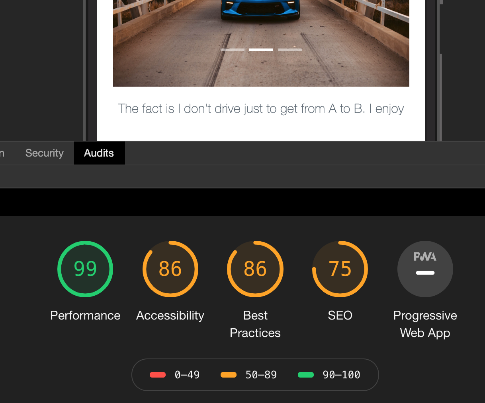

# PWA Ecommerce Application

### Objective

This is a refactor of the "PoWeR LaB" ecommerce platform. In this version of the ecomerce website. This full stack website is changed to a PWA. This process involves implementing a service worker and cache.

### Website Link

feel free to view my project live(Heroku)

https://admin-server-reggieh.herokuapp.com/

### Directions

After you open this application you must first sign up with a name, email and password. This will sign you in, after signing in you will have access to the ADMIN page which allows you to see all PoWeR LaB products. To access ADMIN after logging out, proceed to the login page and enter registered information.

### Operating offline

This application does have support for some features while offline. Each user will still have access to the home page and promotion, however login, logout, and products pages are unavailable.

### ERD

To view ERD see work folder

### Initial Audit

### After Refactor

### Application Preview

### Installation

npm install in "project6" folder to install all dependencies, if you want the app version of this add application to home screen after clicking the link above.

### Technologies

- ReactJs, NodeJs, Javascript, CSS, HTML5, Bootstrap, express, mongoose, jsonwebtoken

### Support

- If you need ant further insight or help contact me

Email: regharris0504@gmail.com

### License

